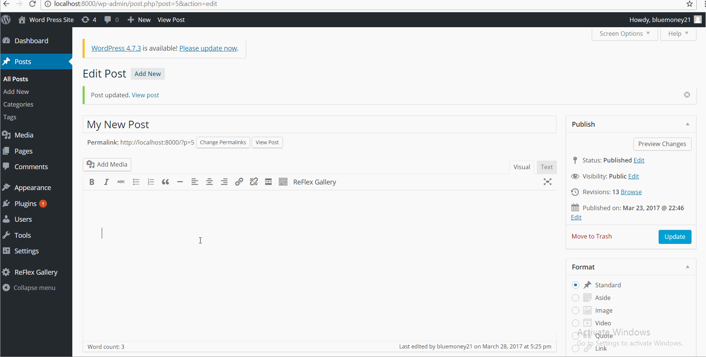

# Project 7 - WordPress Pentesting

Time spent: 3 hours spent in total

> Objective: Find, analyze, recreate, and document **five vulnerabilities** affecting an old version of WordPress

## Pentesting Report

1. (Required) WordPress <= 4.1.1 - Unauthenticated Stored Cross-Site Scripting (XSS)
  - [X] Summary: 
    - Vulnerability types: Cross-Site Scripting (XSS)
    - Tested in version: 4.1.1
    - Fixed in version: 4.1.2
  - [X] GIF Walkthrough: 
      
  - [X] Steps to recreate: 
   1. Go to main site.
   2. Leave a comment with XSS code.
   3. Post comment.
1. (Required) WordPress 3.6.0-4.7.2 - Authenticated Cross-Site Scripting (XSS) via Media File Metadata
  - [X] Summary: 
    - Vulnerability types: Cross-Site Scripting (XSS)
    - Tested in version: 4.1.1
    - Fixed in version: 4.2.13
  - [X] GIF Walkthrough: 
       
  - [X] Steps to recreate: 
   1. Go to Media section.
   2. Select Add New
   3. Add new mp3 with XSS code for the description.
   4. Go to Posts section.
   5. Select Create New.
   6. Select Add Media.
   7. Select Create Audio Playlist.
   8. Select malicious mp3.
   9. Publish post.
   10. Go to main site.
  - [X] Affected source code:
    - [Link 1](https://github.com/WordPress/WordPress/commit/28f838ca3ee205b6f39cd2bf23eb4e5f52796bd7)
1. (Required) WordPress 2.5-4.6 - Authenticated Stored Cross-Site Scripting via Image Filename
  - [X] Summary: 
    - Vulnerability types: Cross-Site Scripting (XSS)
    - Tested in version: 4.1.1
    - Fixed in version: 4.2.13
  - [X] GIF Walkthrough: 
       
  - [X] Steps to recreate: 
   1. Go to Media section.
   2. Select Add New.
   3. Add new image with XSS code for the caption.
   4. Go to Posts section.
   5. Select Add New.
   6. Select Add Media.
   7. Select Create Gallery.
   8. Select malicious image.
   9. Publish post.
   10. Go to main site.
  - [X] Affected source code:
    - [Link 1](https://github.com/WordPress/WordPress/commit/419c8d97ce8df7d5004ee0b566bc5e095f0a6ca8)
1. (Optional) WordPress 4.0-4.7.2 - Authenticated Stored Cross-Site Scripting (XSS) in YouTube URL Embeds
  - [X] Summary: 
    - Vulnerability types: Cross-Site Scripting (XSS)
    - Tested in version: 4.1.1
    - Fixed in version: 4.2.10
  - [X] GIF Walkthrough: 
      
  - [X] Steps to recreate:
   1. Go to Posts section.
   2. Select Create New.
   3. Create embed youtube video with XSS code in post description.
   4. Publish post.
   5. Go to main site.
  - [X] Affected source code:
    - [Link 1](https://github.com/WordPress/WordPress/commit/c9e60dab176635d4bfaaf431c0ea891e4726d6e0)

## Assets

List any additional assets, such as scripts or files

## Resources

- [WordPress Source Browser](https://core.trac.wordpress.org/browser/)
- [WordPress Developer Reference](https://developer.wordpress.org/reference/)

GIFs created with [LiceCap](http://www.cockos.com/licecap/).

## Notes

Describe any challenges encountered while doing the work

## License

    Copyright [2017] [Matthew Blumen]

    Licensed under the Apache License, Version 2.0 (the "License");
    you may not use this file except in compliance with the License.
    You may obtain a copy of the License at

        http://www.apache.org/licenses/LICENSE-2.0

    Unless required by applicable law or agreed to in writing, software
    distributed under the License is distributed on an "AS IS" BASIS,
    WITHOUT WARRANTIES OR CONDITIONS OF ANY KIND, either express or implied.
    See the License for the specific language governing permissions and
    limitations under the License.
